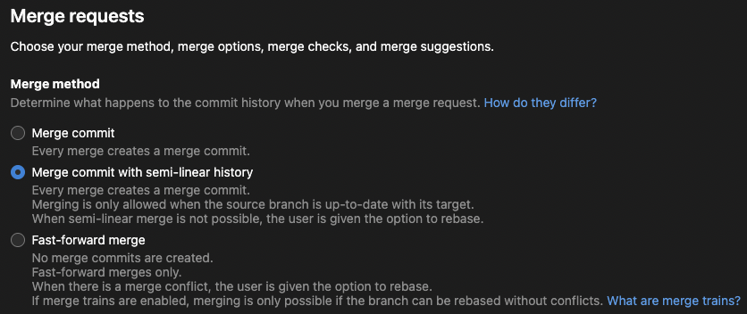
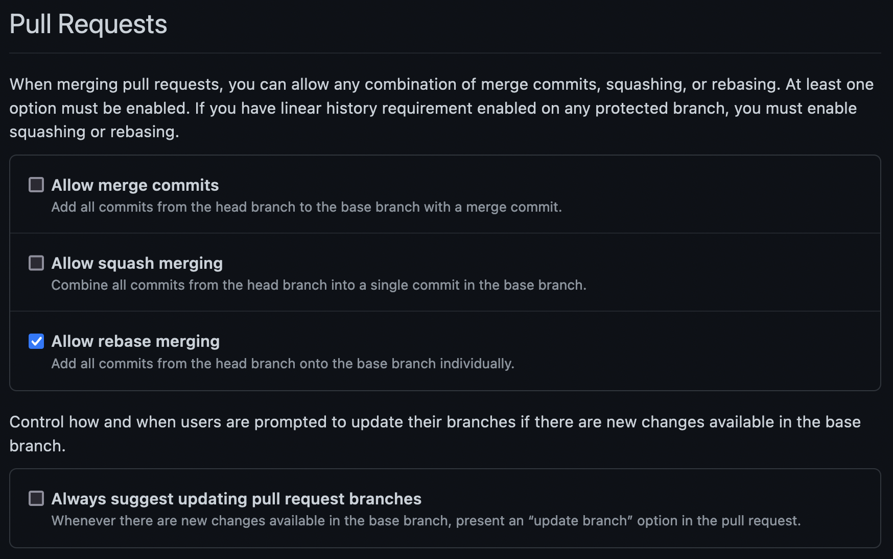

Even with years of experience in this industry, I can never seems to get my head around deciphering these huge and complicated git history trees. One time I had a chance to work on a brand new project with a great degree of freedom in determining our team's development process, and so I set out to find a git workflow that can satisfy me.

I started out by looking at Git flow and Gitlab flow respectively, but none of these workflows are just not simple enough to satisfy the neat freak in me. After months of experimenting, I came up with this workflow that has worked so well that it has been the de-facto default git workflow for all of my projects from then onwards.

Figure: Your git repo can look as clean as this

## This workflow is for you if
- you like your git history to be simple and clean
- you want to onboard your new dev members fast
- you don't care about when commits are actually made in relation to other commits

## This workflow is not for you if
- your dev team is allergic to rebasing 😢
- you're a monster and like messy git histories the way it is 🤮
- other people might add commits to your branch

## Key points

### Rewriting git history is fair game, as long as it's not the main branch

This workflow makes heavy use of rebase. Rebasing in git, is not as scary as they seem to tell you. Rebasing may change the branch commit history, but to me, a branch is just a series of draft commits so I think it's okay to change history (even if it's pushed to a remote repository) as long as it has not been merged. Once you get the hang of it, rebasing branches are a walk in the park.

However, changing commit history means that other people cannot add commits to your branches freely as there is no guarantee that the commits before will still exist. I think that commits should only be done by the branch author themselves, and hence rebasing would not pose such a problem.

### Support for multiple environments (staging, production etc.)

Eventually when you put your project into production you probably want to have different environments to try out new features before it gets shipped into production. This workflow easily supports multiple environments while maintaining a simple and clean git commit history. You don't even need to match the order you push for different environments!

### Only see commits that you've made in your branches

When you merge another branch into your branch, your branch would inevitably be "polluted" with commits from other branches. With this workflow, you can ensure only commits from your branch are visible.

### CI/CD friendly

This workflow works really well if you have a CI/CD environment. Branches must be up to date (ie. branched off the latest commit of the main branch) before it can be merged. This guarantees your branch will pass CI/CD after merging as it is tested on your latest working state.

## Setting it up

Setting it up is very easy. In fact, you can even set it up for existing repositories.

### Step 0: Get your teammates onboard

As git is a team sport, it is important to get your teammates onboard. Or at the very least, least show them this page. Technically you can implement this by yourself but your teammates may become very lost when they realize that they need to start rebasing...

### Step 1: Enforce linear/semi-linear merging

You'll need to enable linear merging or semi-linear merging on whichever git service that you're using.

What are the difference between linear and semi-linear merging? Linear merging does not create a merge commit, but instead fast forwards the main branch to the latest commit of the branch. It'll look something like this:

Figure: Before linear merge

Figure: After performing a linear merge. Git history will become a single straight line

On the other hand, a semi-linear merge will make a merge commit every time you merge a branch:

Figure: Before semi-linear merge

Figure: After semi-linear merge

I personally prefer a semi-linear merge as you can see where a branch starts and end easily.

If you're using Gitlab, you can easily enforce either one in your repository settings under Merge Requests:

Figure: Gitlab's merge request settings. "Merge commit with semi-linear history" for well, semi-linear merging and "Fast-forward merge" for linear merging

In Github, linear merging can be enforced by only allowing rebase merging:

Figure: Only check "Allow rebase merging" if you want linear merging

As for semi-linear merging in Github, unfortunately there's no setting to enforce semi-linear merging. There is a [workaround](https://github.com/community/community/discussions/8940#discussioncomment-2845065) to emulate semi-linear merging but it does not prevent users from merging to update a branch.

### Step 2: Done

There's no step 2! Let it run for a couple of branch merges and let your eyes feast on that beautiful git commit history.

## Workflow scenarios

Here are some common workflow scenarios that I've encountered which may give you a general sense on how the git history may look like with this workflow.

### Scenario #1: A typical feature/bugfix workflow

First you would checkout a new branch from the latest main branch and commit some changes:

While committing new changes there may be new commits added to the main branch:

When you want to reflect the new changes from the main branch we would rebase the working branch against the latest commit from the main branch (while you're at it, feel free to do an interactive rebase if you want to reorganize your commits):

Then just push the branch to the remote repository when you're ready to create a pull/merge request. It does not necessarily need to be up to date, but I would at least resolve any conflicts before requesting a code review.

When you need to add commits (fixes etc.) you can just add new commits, or just add the changes into the existing commits ([lazygit](https://github.com/jesseduffield/lazygit)'s "Amend commit with staged changes" allows you to easily do just that). Personally I would make changes to existing commits when its a minor bug that got caught in CI or linting errors.

And when you're ready to merge you will be prompted to rebase if it's out of date; or else just merge away!

Figure: End result looks something like this

### Scenario #2: Working on top of an unmerged branch

Another common scenario is when you need to use the changes you made on another branch when building another feature. For example, if you need to build on top of `edit-todo`, you would first checkout a new branch (in this case `delete-todo`) off the latest commit `edit-todo` instead of the main branch and add commits to `delete-todo`:

When you diff with the main branch you'll probably notice that the commits from `edit-todo` would appear, and that is okay. Eventually the commits from `edit-todo` will disappear after it has merged. When `edit-todo` gets merged into main, you would just rebase `delete-todo` against the latest commit from the main branch:

Git is smart enough to know that the same commits are already in the main branch and would remove them for you. How neat!

#### Changes on unmerged branch

What if changes were made to the unmerged branch while working on the new branch? If you need to reflect the new changes from the unmerged branch you could try to rebase against the latest commit of the unmerged branch. However, most likely you'll encounter conflicts. In that case, I recommend creating a new branch off the latest commit and **cherry-picking** the commits from the new branch instead.

Figure: If only new commits are added, you can easily rebase against the latest commit

Figure: If commits were modified and you can't rebase easily, cherry-pick the commits into a new branch instead. Be sure to confirm the branch contents before deleting the old branch

### Scenario #3: Working with multiple environments

Let's say I have two environments, production and staging, and I would like to push a new feature to staging so I could preview it before pushing to production. If the production environment is in sync with the main branch, how do I preview features in staging?

Let's assume that I have a branch that is ready to be pushed into the staging environment (`edit-todo`):

I would have a dedicated branch for the staging environment, aptly named `staging` branch, and cherry-pick commits from `edit-todo` to `staging`. You would then configure your staging environment to be in sync with the `staging` branch.

Most likely you would have more that one branch that you would like to preview in the staging environment. In that case, you would just cherry-pick the commits from all the branches you want to preview in staging:

Let's say features added in `edit-todo` was approved and ready to be pushed to production, so you would merge `edit-todo` as usual:

After that, you'll need to **rebase the staging branch against the latest commit from the main branch**. Ideally, you would have a CI job that would rebase the staging branch for you whenever you push new commits to the main branch. After rebasing the staging branch, you'll  notice that the commits from the merged branch would disappear from the staging branch, again due to fact that the commits are already in the main branch and will be removed automatically:

#### The branch order you push to staging does not need to match the order that you push to production!

What if instead of `edit-todo`, `delete-todo` got approved first? Just merge the `delete-todo` branch and rebase the staging branch! The commits from `delete-todo` will disappear from the staging branch instead of the `edit-todo` branch:

And once all the changes have been pushed to production, your main branch and staging branch would be in sync and will share the same latest commit.

#### Even more environments

If you have other environments, you would also create a dedicated branch for that environment and cherry-pick commits to the environments that you'll like to preview the changes. Similar to the staging branch, you would need to make sure the environment branch is always off the latest commit from the main branch.

### Scenario #4: Reviewing rebased branches

When reviewing a branch, you may notice that the commit history changed due to rebasing of these branches. If you need to re-review a branch I recommend deleting the branch and pull a new version of the branch.

## Try it out!

Convinced? Give it a try and [tell me](https://twitter.com/adw1n) how it works for you!
