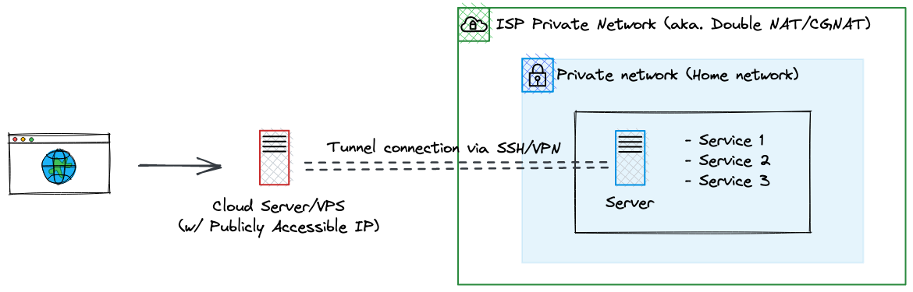
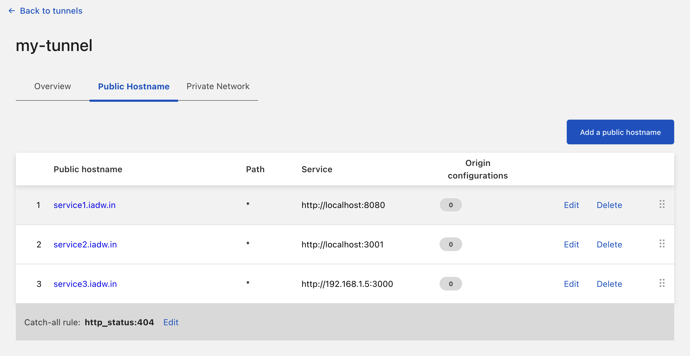

[Cloudflare Tunnel](https://www.cloudflare.com/products/tunnel/) allows one to expose a service hosted within a private network without exposing part of the private network. It is a great alternative to conventional networking tunnels thanks to its ease of use.

I recently replaced [my tunnel server hosted on Oracle cloud](/setting-up-port-forwarding-on-an-oracle-cloud-instance) with Cloudflare Tunnel, allowing me to simplify my homelab setup.


Figure: Network tunnel setup before using Cloudflare Tunnel


Figure: Network tunnel setup after using Cloudflare Tunnel

## Pros
- Port forwarding without opening your server ports
- Exposing services without worrying about security best practices
- Supports servers behind networks that cannot do port forwarding such as double NAT/CGNAT
- Cloudflare proxy features (DDoS protection, HTTPS) included by default
- Able to control who can access your services by adding an auth page before a user accesses a service

## Cons
- Requires domain to be managed under Cloudflare's DNS (not really a con but if you couldn't move your DNS to Cloudflare...)
- Reliance on a third party hosted solution
- Some contents cannot be tunneled through Cloudflare Tunnel (video content such as Plex)
- Requires a daemon to be run within the private network (`cloudflared`)

## Zero Trust

If you looked into Cloudflare Tunnel, you might see the term "Zero Trust" comes up a lot. Cloudflare Tunnel service is a core part of the Cloudflare's Zero Trust platform which aims to replace VPNs. Traditionally, a VPN would allow one to access everything within the network. On the other hand, Zero Trust networks tries to do differently with its "always verify" approach, requiring user to always authenticate before accessing a service.

## Setting Up Cloudflare Tunnel

### Step 1: Establishing a connection between Cloudflare and private network

According to the [Cloudflare Tunnel docs](https://developers.cloudflare.com/cloudflare-one/connections/connect-apps/install-and-setup/tunnel-guide/), you can set up a tunnel either on Cloudflare's Zero Trust dashboard or through your server's CLI. Regardless of which method you choose, you'll need to access the browser anyways, so I decided to set it up through the dashboard. The docs does a great job on explaining [how to set up the tunnel](https://developers.cloudflare.com/cloudflare-one/connections/connect-apps/install-and-setup/tunnel-guide/remote/#1-create-a-tunnel) so I'll omit the explanations here.

Once the tunnel is created, I opted for the docker daemon as my services were already managed in a Docker Compose file.

```yaml
services:
  cloudflare:
    image: cloudflare/cloudflared
    command: "tunnel --no-autoupdate run --token ${CLOUDFLARED_TOKEN}"
```
Code: docker-compose.yml

`CLOUDFLARED_TOKEN` is stored in a separate `.env` file so I could commit my `docker-compose.yml` without exposing my token.

Once the connection is established, the connection status will show __ACTIVE__ on the dashboard.


### Step 2: Configure forwarding to your self-hosted services

On the tunnel entry select __Configure__, and click on the __Public Hostname__ tab. Let's say if I want `service1.iadw.in` to redirect to a service hosted on the same server as the Cloudflare daemon on port 8080, I would set the __Public hostname__ to `service1.iadw.in` and the __Service__ value to `http://localhost:8080`.

Note that you can also redirect to a service hosted on another machine on your private network. If you want to redirect to a service on `192.168.1.5:3000`, you would then set the __Service__ value to `http://192.168.1.5:3000`.

The configs should look something like this:


Figure: For each service, a new public hostname needs to be added

Cloudflare would automatically add the corresponding DNS entry for each route that you added here.

### Step 3: (Optional) Setting up access controls

For services that do not have authentications, you can setup policies to authenticate your users instead. In short, you'll need to add the service as a self-hosted application under __Access__ > __Applications__, define a policy that consist of who and what authentication methods users can use, and add the policy to the application entry that you created.

By default, Cloudflare's default auth method will send an email containing a code to your user, which your use will need to enter on the auth page. Other authentication method includes Google and SAML-based authentication.

### Step 4: Try it out!

Access your applications via the __Hostname__ that you defined previously. You should be able to view the service even without connecting to your local network, nor a VPN. Congratulations, now you've successfully set up Cloudflare Tunnel.
