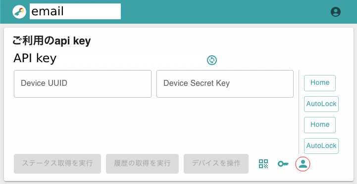

<div class="bg-slate-200 py-4 px-6 rounded">
<b>[Update 2024/02/04]:</b> Instead of using Sesame's Web APIs, I <a href="/removing-cloud-dependency-of-sesame-lock-with-esphome">reintegrated my Sesame Lock without depending on the cloud</a> using an ESP32 module.
</div>

I've been using [Sesame Lock](https://jp.candyhouse.co/products/sesame4) for the past 1.5 years. At around ￥10,000 which also includes the Wifi Module and Sesame Bot (IoT button), it is a great option for those interested in a smart lock without breaking the bank. In addition, one could control it with a web API, opening up possibilities to integrate with any setup.

While I relied on iOS shortcuts to unlock my doors, I came across a great post by Tats Shibata on [how to integrate the new Sesame Locks with Home Assistant](https://rewse.jp/blog/control-sesame-home-assistant/). As the official Home Assistant integration only support models before Sesame 3, it took some effort to make the new Sesame locks work with Home Assistant.

## Obtaining API key, Device UUID and Secret Key

The easiest way to integrate Sesame into Home Assistant is via their web API. Do note the web API is only free up to 30,000 calls a month, which I think is sufficient for day-to-day use. There are libraries such as [pysesameos2](https://github.com/mochipon/pysesameos2) that controls Sesame via Bluetooth communication, but I won't be exploring these method for now.

To obtain an API key, go to [Sesame API portal](https://partners.candyhouse.co/) and login with the email that you used to login into the mobile app.


Figure: Sesame API portal

In the API portal, click on the user icon circled in red. You'll see your devices appear on the right. You might need to click on the icon a couple of times for all of the devices that you own to appear. Then, click on the device that you want to control. The device UUID and secret key fields will be populated. Add these values to your `secrets.yaml` file.

```yaml
sesame_api_key: [api_key]
sesame_device_uuid: [device_uuid]
sesame_device_secret: [secret_key]
```
Code: secrets.yaml

## Getting Device Status

Getting the device status is as easy as issuing a HTTP GET request:

```bash
$ curl -s -H "x-api-key: $API_KEY" https://app.candyhouse.co/api/sesame2/$DEVICE_UUID | jq
{
  "batteryPercentage": 100,
  "batteryVoltage": 6.003519061583578,
  "position": 479,
  "CHSesame2Status": "locked",
  "timestamp": 1642253725,
  "wm2State": true
}
```

You can integrate the status into a Home Assistant sensor using the [RESTful Sensor integration](https://www.home-assistant.io/integrations/sensor.rest/):

```yaml
# you can't use secrets directly in a template string hence this workaround
input_text:
  sesame_device_uuid:
    initial: !secret sesame_device_uuid

sensor:
  - platform: rest
    name: Sesame Lock Sensor
    # Adjust the scan interval so you don't get rate limited
    scan_interval: 600
    method: GET
    headers:
      x-api-key: !secret sesame_api_key
    resource_template: "https://app.candyhouse.co/api/sesame2/{{ states('input_text.sesame_device_uuid') }}"
    value_template: '{{ value_json.CHSesame2Status }}'
    json_attributes:
      - batteryPercentage
      - batteryVoltage
      - position
      - CHSesame2Status
      - timestamp
```
Code: Sesame Lock sensor config

## Sending Commands to the Device

Unfortunately sending commands to the device is not as easy as getting the status. The secret key needs to be encrypted before sending, which is not achievable via the YAML config. Home Assistant's [Python Script integration](https://www.home-assistant.io/integrations/python_script/) isn't good enough as you'll need to import modules to encrypt the secret key. But it is simple enough to make a standalone script like so:

```python
#!/usr/bin/env python3

import base64, datetime, json, requests, sys
from Crypto.Cipher import AES
from Crypto.Hash import CMAC

COMMANDS = {
    "lock": 82,
    "unlock": 83,
    "toggle": 88,
}

def main():
    try:
        command = sys.argv[1]
        api_key = sys.argv[2]
        uuid = sys.argv[3]
        secret = sys.argv[4]
    except IndexError:
        print("Usage: sesame <lock|unlock|toggle> <api_key> <uuid> <secret>")
        sys.exit(1)

    cmd = COMMANDS[command]

    history = base64.b64encode("HomeAssistant".encode()).decode()

    ts = int(datetime.datetime.now().timestamp())
    msg = ts.to_bytes(4, byteorder="little").hex()[2:8]

    cmac = CMAC.new(bytes.fromhex(secret), ciphermod=AES)
    cmac.update(bytes.fromhex(msg))
    sign = cmac.hexdigest()

    url = f'https://app.candyhouse.co/api/sesame2/{uuid}/cmd'
    headers = { "x-api-key": api_key }
    body = { "cmd": cmd, "history": history, "sign": sign }

    res = requests.post(url, json.dumps(body), headers=headers)
    print(url, headers, body)
    print(res.status_code, res.text)

if __name__ == "__main__":
    main()
```
Code: sesame.py

Save this file somewhere in your Home Assistant config and make it executable:

```bash
$ chmod +x sesame.py
```

You can then call the script like so via the command line:

```bash
$ /config/python_scripts/sesame.py [lock|unlock|toggle] $API_KEY $DEVICE_UUID $DEVICE_SECRET
```

And here's how to integrate the commands into Home Assistant using the [Shell Command integration](https://www.home-assistant.io/integrations/shell_command/):

```yaml
shell_command:
  sesame: "/config/python_scripts/sesame.py {{ command }} {{ api_key }} {{ uuid }} {{ secret }}"

scripts:
  lock_sesame:
    sequence:
      - service: shell_command.sesame
        data_template:
          command: lock
          api_key: !secret sesame_api_key
          uuid: !secret sesame_device_uuid
          secret: !secret sesame_device_secret

  unlock_sesame:
    sequence:
      - service: shell_command.sesame
        data_template:
          command: unlock
          api_key: !secret sesame_api_key
          uuid: !secret sesame_device_uuid
          secret: !secret sesame_device_secret
```
Code: Sesame Lock commands config

If all goes well, you should be able to invoke commands by using `scripts:lock_sesame` and `scripts:unlock_sesame` service.

## Bringing them all together in a single device

We can finally combine the sensor and controls into a single entity using the [Template Lock](https://www.home-assistant.io/integrations/lock.template/) integration:

```yaml
lock:
  - platform: template
    name: Sesame Lock
    value_template: "{{ is_state('sensor.sesame_lock_sensor', 'locked') }}"
    lock:
      service: script.lock_sesame
    unlock:
      service: script.unlock_sesame
```
Code: Sesame Lock entity config

All done! You can now integrate the Sesame lock into your Home Assistant using `lock.sesame_lock`. My Sesame Lock config can be found in [my Home Assistant config Github repository](https://github.com/adwinying/homeassistant-config/commit/8cfdb15243c562783d3ce0f4e3f538e6f40da2e5).
