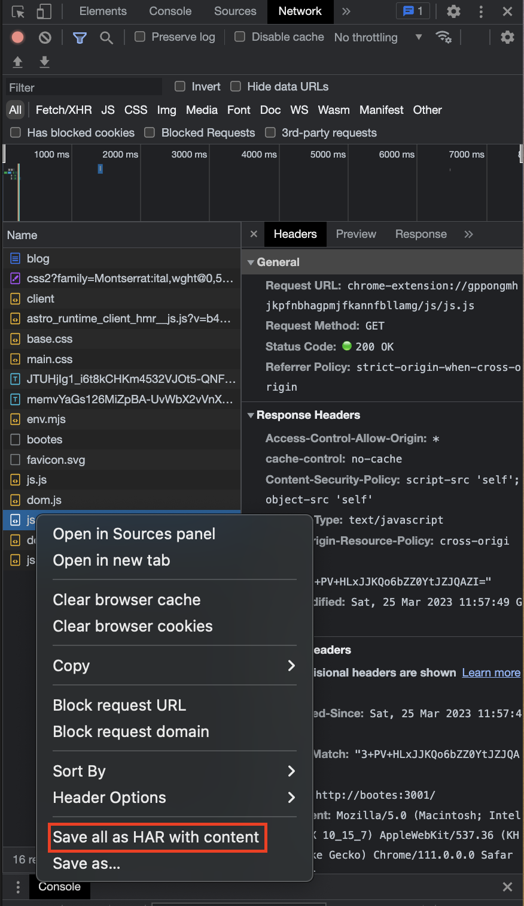

While I was performing web scraping, I discovered that I needed a specific string of characters to make an HTTP request to retrieve the information I was after. Unfortunately, I couldn't find the string of characters anywhere except in the header of a specific AJAX request. In this post, I will share my experience in attempting to extract this string programmatically.

## Introducing HAR


Figure: Under devtools > network tab, right click on any of the request and you'll see the term HAR

If you've ever explored the network tab of your browser's devtools, you've probably come across the term HAR. HAR stands for HTTP Archive and is used to record all HTTP traffic exchanged between a web browser and a web server. Essentially, everything that you can access in the network tab is encompassed within an HAR file.

## Generating HAR programmatically

Unfortunately, there isn't a command-line interface tool available that can produce an HAR (HTTP Archive) for a particular URL. In fact, to capture the AJAX request, you must allow Javascript to execute and complete its tasks, which can only be accomplished through the use of a browser. Although there are numerous headless browsers available for programmatic use, I utilized Playwright on this occasion.

First, initialize a new NodeJS project:

```bash
$ npm init -y
```

Then install Playwright as a dependency:

```bash
$ npm i playwright
```

Then, create a new file named `index.js`:

```js
const playwright = require('playwright');

(async () => {
  const browser = await playwright.chromium.launch({});
  const context = await browser.newContext({
    recordHar: { path: 'result.har' }
  });
  const page = await context.newPage();
  await page.goto('https://example.org', { waitUntil: 'networkidle' });

  await context.close();
  await browser.close();
})();
```
Code: `index.js`

Then in `package.json`, add a script command named `start`:

```json
{
  ...
  "scripts": {
    "start": "node index.js",
    ...
  }
}
```

If everything is in order, a `result.har` file will be generated when you run `npm start`.

## Parsing the contents of an HAR

Turns out, HAR is just a JSON file, so you can use `jq` to parse the JSON contents and extract whatever you need.

```json
{
  "log": {
    "version": "1.2",
    "creator": {
      "name": "Playwright",
      "version": "1.31.2"
    },
    "browser": {
      "name": "chromium",
      "version": "111.0.5563.19"
    },
    "pages": [...],
    "entries": [
      {
        "startedDateTime": "2023-03-31T05:33:58.720Z",
        "time": 203.736,
        "request": {
          "method": "GET",
          "url": "https://api.example.org",
          "httpVersion": "HTTP/2.0",
          "cookies": [],
          "headers": [
            { "name": "foo", "value": "bar" },
            ...
          ],
          "queryString": [],
          "headersSize": 583,
          "bodySize": 0
        },
        "response": {
          "status": 200,
          "statusText": "",
          "httpVersion": "HTTP/2.0",
          "cookies": [],
          "headers": [],
          "content": {
            "size": 6261,
            "mimeType": "text/html",
            "compression": 0,
            "text": "..."
          },
          "headersSize": 0,
          "bodySize": 6957,
          "redirectURL": "",
          "_transferSize": 6957
        },
        ...
      },
```
Code: HAR contents

Assuming you want to extract the header `foo` from `GET api.example.org`:

```bash
$ jq '.log.entries[] | select(.request.url | contains("api.example.org")) .request.headers[] | select(.name == "foo") .value')
```

Which will return `bar` from the example above.

## Bringing it altogether in a script

Under the same directory, create a bash script with the following contents:

```bash
#! /bin/bash

# Change current directory to where the script is
cd $(dirname $0)

# Generate HAR
npm start --silent

# Extract foo header value
cat result.har | jq '.log.entries[] | select(.request.url | contains("api.example.org")) .request.headers[] | select(.name == "foo") .value'
```
Code: `get_foo.sh`

Then use `chown` to make it executable:

```bash
$ chown +x get_foo.sh
```
