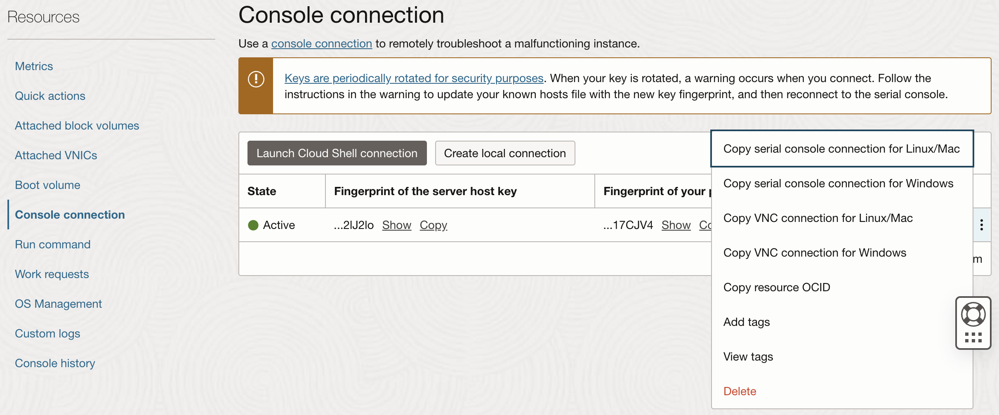
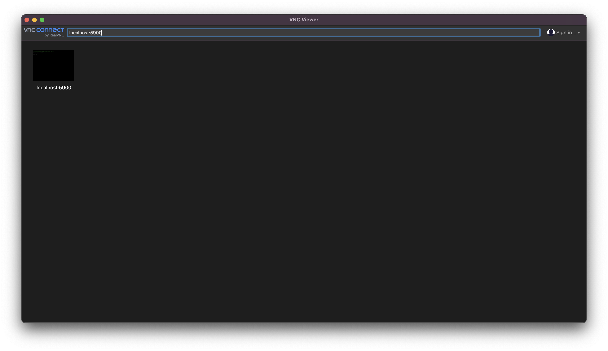
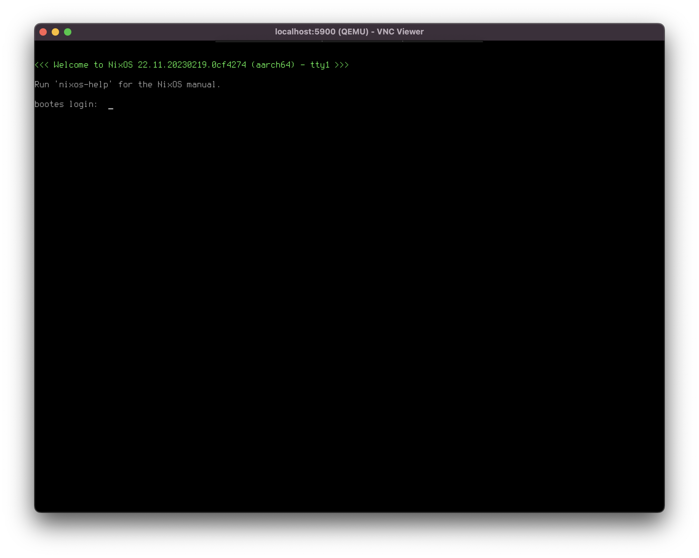
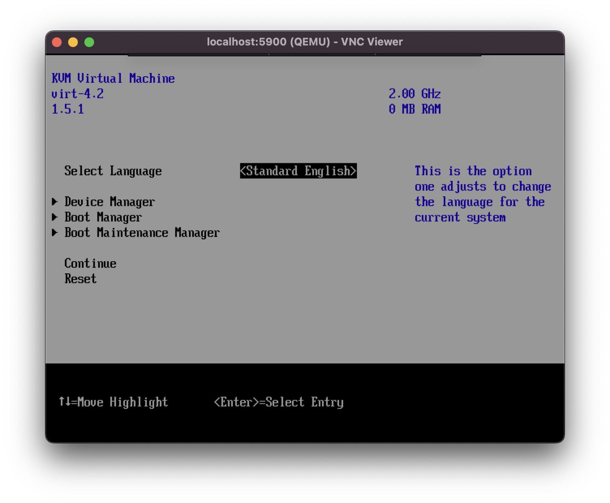
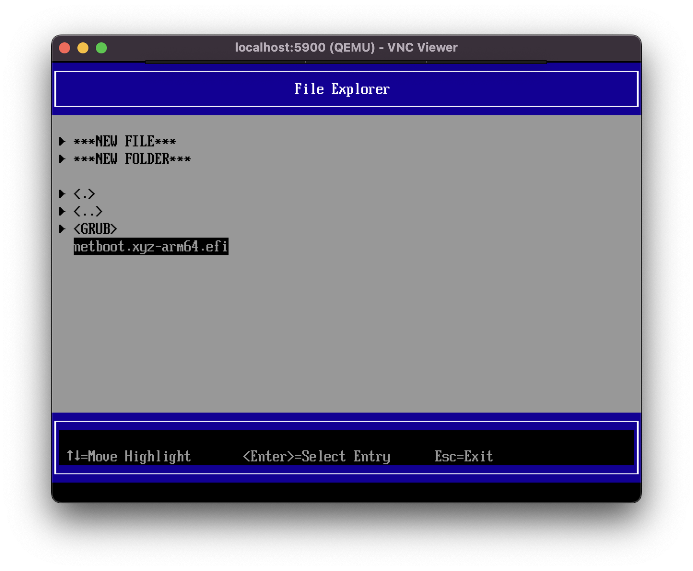
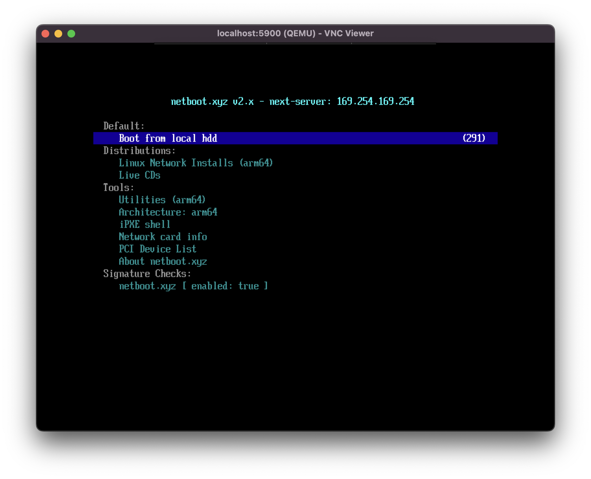

In a cloud environment, you would typically "reset" a VM to its factory state by destroying and recreating an instance. However, Oracle Cloud's free resources are pretty much unobtainium right now, where it's most likely you'll see the "out of capacity in your region" error message. Even with an [automated script](https://github.com/hitrov/oci-arm-host-capacity) to attempt creating an instance periodically, it'll still take a couple of days to actually get an instance recreated.

At the same time, unlike in a local machine you can't just plug in a USB and boot into a live environment and format + reinstall the OS. But with the power of netbooting we can somewhat replicate something similar in a cloud environment.

## Part 1: Prepare netboot environment

First, we will need to prepare an netboot environment to boot into. Netboot, as the name somewhat suggests allows us to boot into a live installation via the network, skipping the need to boot into a physical media. Here we will use [netboot.xyz](https://netboot.xyz/), which will act as a gateway to boot into a Linux distro's live environment.

In your Oracle Cloud instance, download the netboot.xyz image to `/boot`:

```bash
$ cd /boot
$ wget https://boot.netboot.xyz/ipxe/netboot.xyz-arm64.efi # for ARM instances
$ wget https://boot.netboot.xyz/ipxe/netboot.xyz.efi # for x86 instances
```

## Part 2: Setting up a VNC connection

Next, we need to set up a VNC connection. Unlike an SSH connection, a VNC connection to our instance allows us to control the instance during the reboot process, which we will be able to change the boot method.

In your Oracle Cloud console, go to __Compute > Instances > [instance name]__ and select __Console connection__ on the Resources sidebar on the left. Then, select __Create local connection__ and setup a SSH keypair. Then create the local connection. 

When the connection is active and running, click the three dots on the right > __Copy VNC connection for Linux/Mac/Windows__, depending on your platform. This will copy an SSH port forwarding command, which you will run in a machine that has the SSH private key set previously.


Figure: Creating a Oracle Cloud console connection for VNC

Run the SSH port forwarding command. If all goes well, the VNC connection is now bound to `localhost:5900`, which you can use a VNC client to connect to your cloud instance.

> 💡 If you're on MacOS, the native Screen Sharing app does not work. Use a 3rd party VNC Client like [RealVNC](https://www.realvnc.com/en/connect/download/viewer/).


Figure: RealVNC Viewer


Figure: If your VNC connection is successful, you should be able to see a login prompt like this

## Part 3: Boot into netboot environment

Using the VNC connection that you set up previously, login to root or a user with root privileges. Initiate a reboot command:

```bash
$ sudo reboot
```

The instance will now reboot. When you see a __TianoCore__ boot screen, press `Esc`, which will then bring you to the UEFI menu:


Figure: UEFI Menu

Select __Boot Maintenance Manager > Boot From File > [disk details] > EFI > netboot.xyz-arm64.efi__ and hit `Enter`.


Figure: UEFI File Explorer

Once netboot.xyz is loaded, you should be greeted with the menu below:


Figure: netboot.xyz Menu

From here you can select __Linux Network Installs__, and select the Linux distro that you would like to boot into. Note that not all distro work, and if you're stuck on a blank screen you can hit `Ctrl + Alt + Del` to restart your cloud instance and try a different distro. For me, I tried ubuntu, Debian and Alma Linux, and only Debian was the only one that works. Once booted into the live installation, just follow the prompts and you'll have a fresh install of Linux in your cloud instance.
