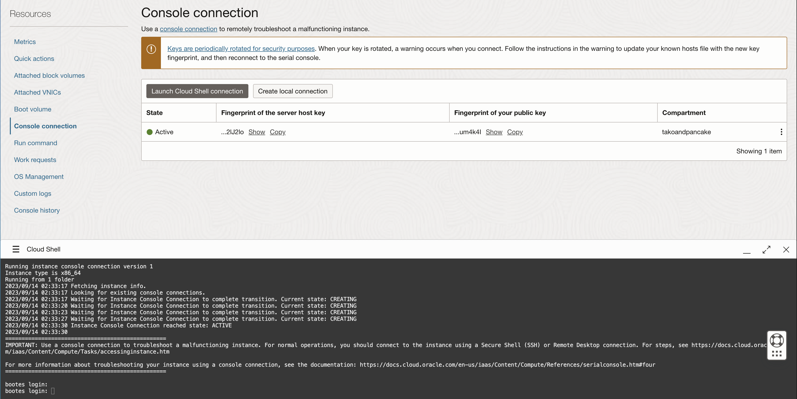
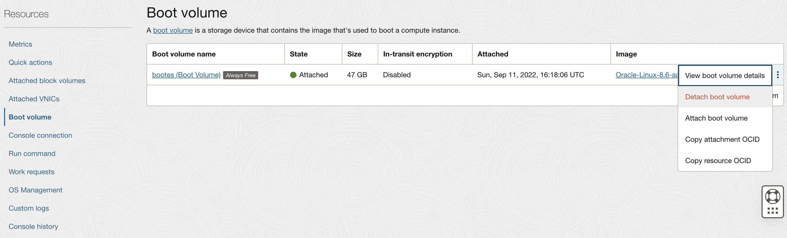
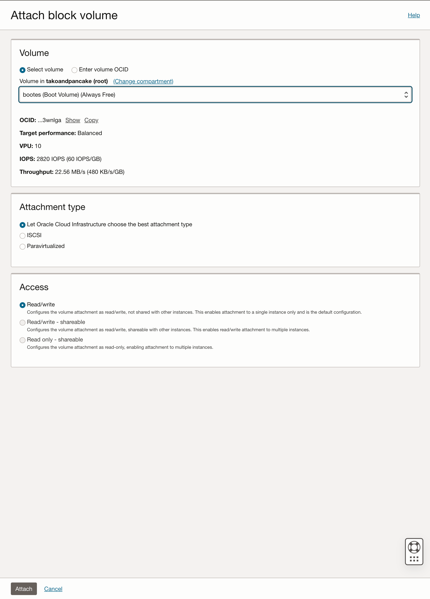
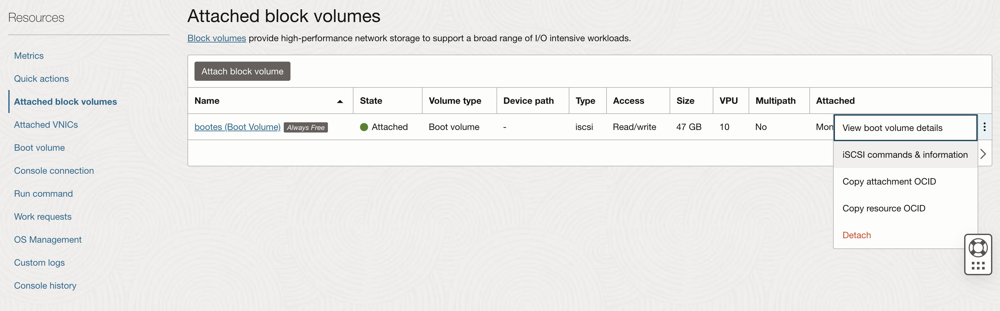

So, you've messed with the wrong settings and you cannot connect to your Oracle Cloud VM. Here are two methods you could try before needing to [nuke your instance](/how-to-reset-an-oracle-cloud-vm-instance) and set up everything from scratch again.

## Method 1: Oracle Cloud Shell

If you somehow managed to break your SSH connection, you can try the Oracle Cloud Shell. It is basically a terminal shell that you can access directly on your browser via the Oracle Cloud console.

In your Oracle Cloud console, go to __Compute > Instances > [instance name]__ and select __Console connection__ on the Resources sidebar on the left. Then, click on the __Launch Cloud Shell connection__ button. A shell console will launch at the bottom of your screen. Once the cloud shell is successfully initialized (which may take a while), you'll be prompted to login with your user credentials.


Figure: Oracle Cloud shell

## Method 2: Attaching the boot volume to another VM instance

If your VM fails to boot because of a setting change, this method might be for you. In short, we will temporarily mount the broken VM's boot volume to another working VM and revert the changes made that cause the VM to break. For this method to work, you'll need to have another VM instance that is active and running.

### Detaching the broken VM's boot volume

In your Oracle Cloud console, go to __Compute > Instances > [instance name]__ and click __Stop__ to power down the VM. Then, select __Boot volume__ on the Resources sidebar on the left. Select the 3 dots on the right of your boot volume and select __Detach boot volume__.


Figure: Oracle Cloud boot volume settings

Once the boot volume state shows __Detached__, you may proceed to the next step

### Attaching the broken VM's boot volume to another instance

Navigate to the other instance, and select __Attached block volumes__ on the Resources sidebar on the left. Then, select __Attach block volume__.


Figure: Attach a new block volume

Here, you should be able to select the boot volume that we detached previously. Leave the rest of the settings as default and make sure you allow read/write access. Then, select __Attach__. You should see a new entry added to the attached block volumes.


Figure: Oracle Cloud attached block volume settings

### Configure iSCSI

In order for the rescue VM to detched the newly attached volume, we need to run some iSCSI commands on the rescue VM. First, we need to get the commands to run. Click the 3 dots on the right of the attached block volume and select __iSCSI commands & information__. Copy the commands needed to attach and detach the volume and save it for later.

Next, get into a shell prompt in the rescue VM and run the attach commands. Assuming you're running Linux, you should see a new drive entry when you run `lsblk`. You'll then mount the drive as how you would do in linux:

```bash
$ sudo mkdir /mnt/tmp
$ sudo mount /dev/[drivename] /mnt/tmp
```

Make the neccessary fixes and you can reattach the boot volume to the broken VM. In the case where the VM is beyond repair, you can use the same method to extract data that you need.

### Detach block volume

First, ensure the drive is unmounted:

```bash
$ sudo umount /mnt/tmp
```

Then run the detach commands that you've saved from __iSCSI commands & information__. Once the commands are sucessfully executed, you can now safely remove the boot volume by detaching it from the rescue VM.

When the boot volume disappears from the attached block volumes list, go back to the broken VM instance and reattach the boot drive. With your fingers crossed, start the VM instance and hopefully your VM is restored to a working state.
