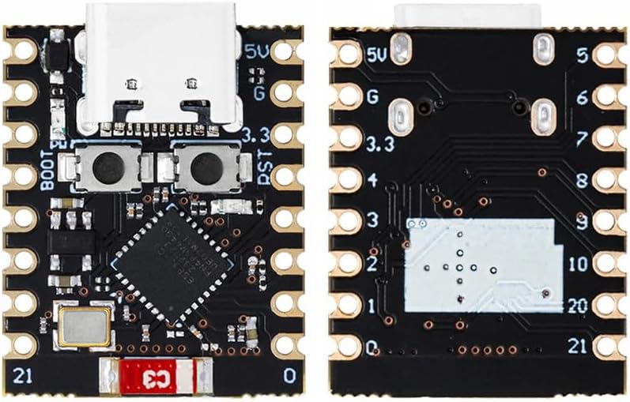

[I've been unlocking my doors with the Sesame Web API via Home Assistant](/integrating-the-new-sesame-lock-with-home-assistant) for 1.5 years. 9 out of 10 times it works as expected but the connection of the Wifi Module is does drop out from time to time, showing a red LED indicator. Because of this I still had to carry my keys as a backup plan. At the same time, the Sesame lock is the only component in my smart home that requires me to control it via the cloud, which does bother me from time to time.

Recently I get logs from Home Assistant stating that it timed out while attempting to get the state of the Sesame lock from the cloud. Wanting to do something about it, I did a quick search and came across a Github repository called [esphome-sesame3](https://github.com/homy-newfs8/esphome-sesame3), which is a ESPHome module that acts as a bridge (ie. Bluetooth proxy) to control Sesame devices via MQTT or any protocol that ESPHome supports. This is much more ideal solution to me than relying on the Web APIs, hence I decided to take the plunge and try it out.

## Getting the Hardware


Figure: waves ESP32-C3 Super Mini. This device is about the size of my thumb!

As ESPHome only runs on the ESP microcontrollers, I had to first buy one. ESP microcontrollers are well known in the smart home world as they are cheap and comes with Wifi built in, which makes it a great way to make an existing device smart or create a smart sensor from scratch. ESP8266 are the most common one in the family, but for Bluetooth support I'll need to get an ESP32 instead. I searched Amazon.co.jp for the cheapest ESP32 device that I could find and came across this [tiny ESP32](https://www.amazon.co.jp/gp/product/B0CQQT35XS) for ￥1,180. Admitted there were cheaper ones, but the size and USB-C port was somewhat hard to resist.

## Building the Firmware

[esphome-sesame3](https://github.com/homy-newfs8/esphome-sesame3) had a excellent guide to create a configuration file for ESPHome. In addition to following the guide, here's what I did to get rid of the errors:

### Additional `platformio_options`

I added the following options under `platformio_options`:

```yaml
esphome:
  platformio_options:
    board_build.flash_mode: dio
```

### Set framework to `arduino`

I tried using `esp-if` framework as it seems to have better compatibility with ESP32-C3, but it does not load the external libraries so be sure to stick to `arduino` for the framework:

```yaml
esp32:
  board: lolin_c3_mini
  variant: esp32c3
  framework:
    type: arduino
```

For board I just went with `lolin_c3_mini` as it looks the most similar to what I have, but since I'm not using the GPIO pins any one will be fine as long as they are of the same ESP variant.

### Downgrading to v0.5.0

At the time of writing the latest version of [esphome-sesame3](https://github.com/homy-newfs8/esphome-sesame3) is v0.7.0, but it seems that it requires some header files from ESPHome that it couldn't find. Downgrading to v0.5.0 solves this issue:

```yaml
external_components:
  - source:
      type: git
      url: https://github.com/homy-newfs8/esphome-sesame3
      ref: v0.5.0
    components: [ sesame_lock, sesame_ble ]
```

### Obtaining Read/Write access to device via USB

When trying to write the firmware to the device, I got a error saying failed to write to device. I was able to get write access by executing the following commands:

```bash
$ sudo usermod -aG dialout $(whoami)
$ sudo chmod a+rw /dev/ttyACM0
```

In my case, `/dev/ttyACM0` is the path of the ESP device when I connect the device via USB.

## Configuring the Device and Home Assistant

After successfully loading ESPHome onto the hardware, it was time to configure it. Instead of allowing ESPHome to directly talk to Home Assistant, I opt to configure MQTT on ESPHome instead as all my other smart devices communicate with Home Assistant via MQTT. With this, I could replace my old Web API-based Home Assistant configs by using the MQTT lock integration instead.

Here are the related commits that I created for this project:
- [ESPHome configuration](https://github.com/adwinying/homeassistant-config/commit/7faee4009a035387f08d8d890ba3d6a03a5d360b)
- [Home Assistant configuration](https://github.com/adwinying/homeassistant-config/commit/20b7a87b38e2c9f0162ef407f628626c349cddc5)
